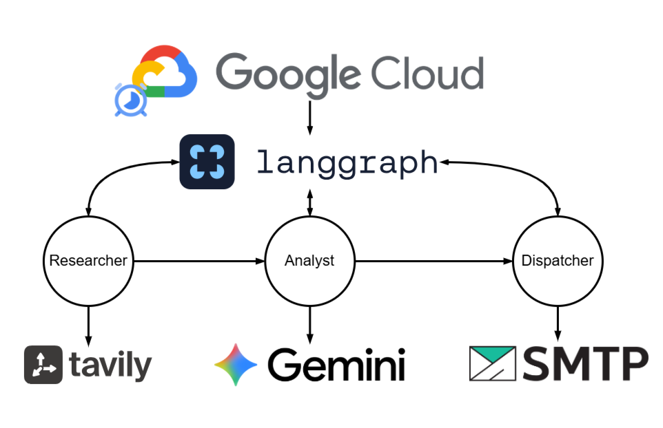

# Weekly Email News Digest Agent

An automated weekly news curation and delivery system built with LangGraph, Google Gemini, and Tavily. This agent researches specific company news from the past week, analyzes the findings, and delivers a formatted weekly briefing via email every Monday.



## Features

- **Automated Research:** Uses the Tavily Search API to find the latest news from the past week, specifically configured to filter out social media and Wikipedia for high-quality sources.
- **Intelligent Analysis:** Leverages Google Gemini (Gemini 2.5 Flash) to synthesize raw news into a concise, actionable weekly summary.
- **Agentic Workflow:** Built using LangGraph to manage the state and transitions between research, analysis, and delivery.
- **Email Delivery:** Automatically formats the summary into a professional HTML/Markdown weekly email and sends it via SMTP.
- **Cloud Native:** Deployed to Google Cloud Platform using Cloud Run Jobs and Cloud Scheduler for reliable, serverless execution.

## Workflow

1.  **Research Node:** Queries Tavily for news related to "The Wonderful Company" and its brands (FIJI Water, Wonderful Pistachios, etc.) from the past week.
2.  **Analyst Node:** Processes the search results to identify key business milestones and updates for a weekly briefing.
3.  **Email Node:** Generates a dual-format (Plain Text & HTML) weekly email and dispatches it through a configured SMTP server.

## Deployment to Google Cloud Platform (GCP)

Deploy the agent to GCP as a Cloud Run Job using Google Cloud Shell Editor:

### 1. Copy Files to Cloud Shell

In **Google Cloud Shell Editor**, create a project directory and copy `main.py`, `requirements.txt`, and `Procfile` into it.

### 2. Deploy to Cloud Run Jobs

Open the Cloud Shell terminal in that directory and run:

```bash
gcloud run jobs deploy news-breif-agent \
  --source . \
  --region YOUR_REGION \
  --set-env-vars "TAVILY_API_KEY=your_tavily_api_key,GOOGLE_API_KEY=your_google_api_key,EMAIL_SENDER=your_email@gmail.com,EMAIL_RECEIVER=recipient@example.com,EMAIL_PASSWORD=your_app_password,SMTP_SERVER=smtp.gmail.com,SMTP_PORT=465"
```

Replace `YOUR_REGION` with your target GCP region (e.g. `us-central1`) and set your API keys and email configuration values.

### 3. Execute or Schedule the Job

- **Execute Manually:**
  ```bash
  gcloud run jobs execute news-breif-agent --region YOUR_REGION
  ```

- **Schedule (Optional):** Use GCP Cloud Scheduler to trigger the Cloud Run Job automatically on a recurring schedule (e.g., weekly).
